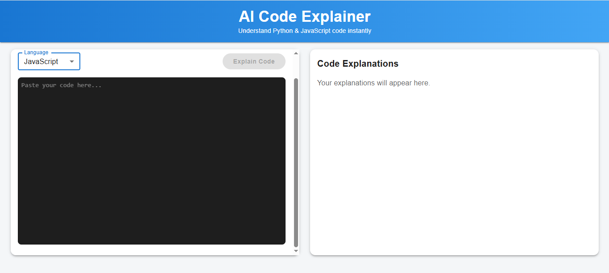
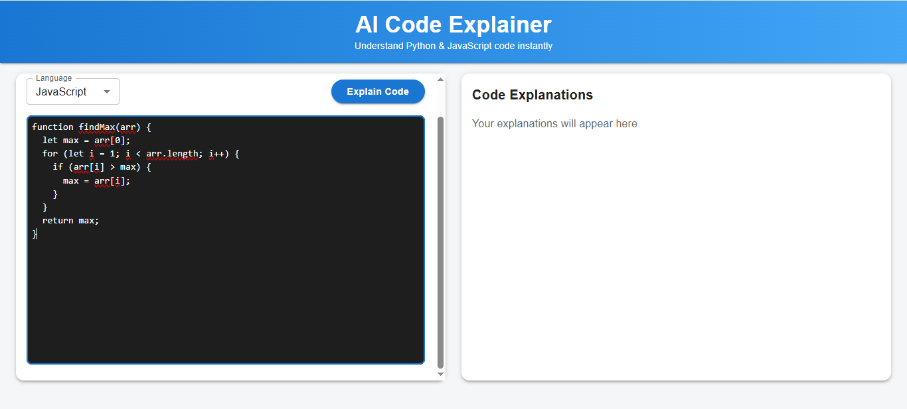
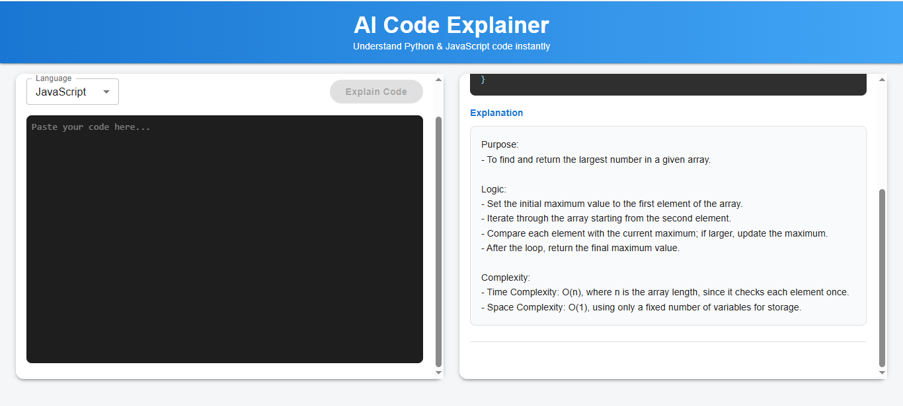

# AI Code Explainer

## Overview

AI Code Explainer is a web-based tool that allows users to paste a snippet of **JavaScript or Python code** and receive a **plain-English explanation generated by an AI model**.

The goal of the application is to help developers quickly understand unfamiliar code by providing a structured explanation of:

* The **purpose** of the code
* The **logic and key operations**
* The **time and space complexity** (when detectable)

The system leverages a **Large Language Model (LLM)** through the OpenRouter API to analyze and explain the code.

---

# Features

* Accepts **JavaScript and Python** code snippets
* Generates **plain-English explanations (2–4 sentences)** using AI
* Displays explanations in a **structured format**:

  * Purpose
  * Logic
  * Complexity
* **Syntax highlighting** for input code
* **History panel** to view multiple submitted explanations
* **Loading indicator** while the AI processes the request
* Clean, modern **React + Material UI interface**

---

# Example Output

If a user submits:

```javascript
function findMax(arr) {
  let max = arr[0];
  for (let i = 1; i < arr.length; i++) {
    if (arr[i] > max) {
      max = arr[i];
    }
  }
  return max;
}
```

The AI generates:

**Purpose**

* Finds the maximum value in an array.

**Logic**

* Initializes the first element as the maximum value.
* Iterates through the array using a loop.
* Compares each element with the current maximum.
* Updates the maximum value when a larger element is found.

**Complexity**

* Time Complexity: O(n) since the array is traversed once.
* Space Complexity: O(1) as only a constant amount of memory is used.

---

# System Architecture

```
React Frontend
     │
     │ User submits code snippet
     ▼
OpenRouter API
     │
     │ Sends prompt + code to LLM
     ▼
LLM Model (StepFun / GPT / Mistral)
     │
     │ AI generates explanation
     ▼
Frontend UI
     │
     ▼
Displays explanation with syntax highlighted code
```

---

# Technology Stack

**Frontend**

* React
* Material UI
* React Syntax Highlighter
* Vite

**AI Integration**

* OpenRouter API
* StepFun LLM (step-3.5-flash)

---

# Key Technical Decisions

## 1. Using OpenRouter for LLM Access

OpenRouter provides a unified API to multiple LLM providers.
This allows the system to remain flexible and easily switch models if needed.

Benefits:

* Access to multiple models
* Lower latency options
* Cost flexibility
* Future extensibility

---

## 2. Structured Prompting

Instead of requesting a free-form explanation, the system enforces a **structured prompt format**:

```
Purpose
Logic
Complexity
```

This improves:

* **Consistency**
* **Readability**
* **Reduced hallucination risk**

---

## 3. Syntax Highlighting

The tool uses **react-syntax-highlighter** to highlight code blocks, making it easier for users to visually identify functions, loops, and logic structures.

---

## Handling Hallucinations and Code Accuracy

LLMs can occasionally produce inaccurate explanations. The application mitigates this risk through:

### Structured Prompts

The prompt forces the AI to follow a strict explanation format, preventing unnecessary speculation.

### Clear Instructions

The model is instructed to:

* Avoid repeating code
* Use bullet points
* Return complexity only if determinable

### Displaying Original Code

The UI always shows the **original user code alongside the explanation**, allowing users to verify the explanation.

---

# Setup Instructions

## 1. Clone the Repository

```
git clone https://github.com/yourusername/ai-code-explainer.git
cd ai-code-explainer
```

---

## 2. Install Dependencies

```
npm install
```

---

## 3. Configure Environment Variables

Create a `.env` file:

```
VITE_OPENROUTER_API_KEY=your_api_key_here
```

---

## 4. Run the Application

```
npm run dev
```

The app will run at:

```
http://localhost:5173
```

---
# Demo Images
## Application Interface



## Code Input screenshot



## Code Explanation screenshot



# Future Improvements

Potential enhancements include:

* AI-generated **optimized code suggestions**
* **Diff view** comparing original vs optimized code
* **AST-based code parsing** for deeper analysis
* Additional language support (Java, C++, Go)
* Export explanations as documentation

---

# Author

Roshan Farakate
Backend Engineer | Java | Spring Boot | Distributed Systems
